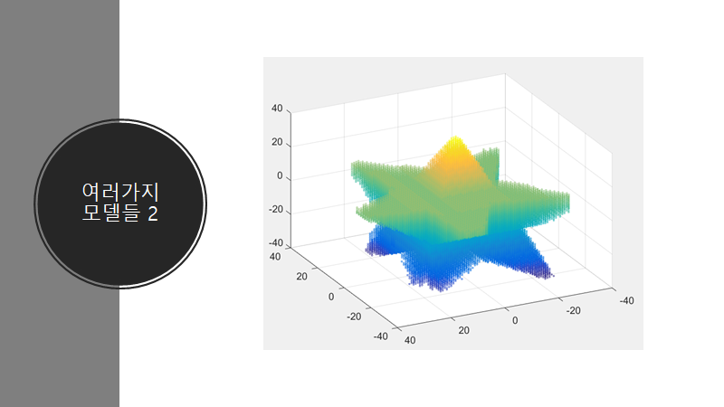
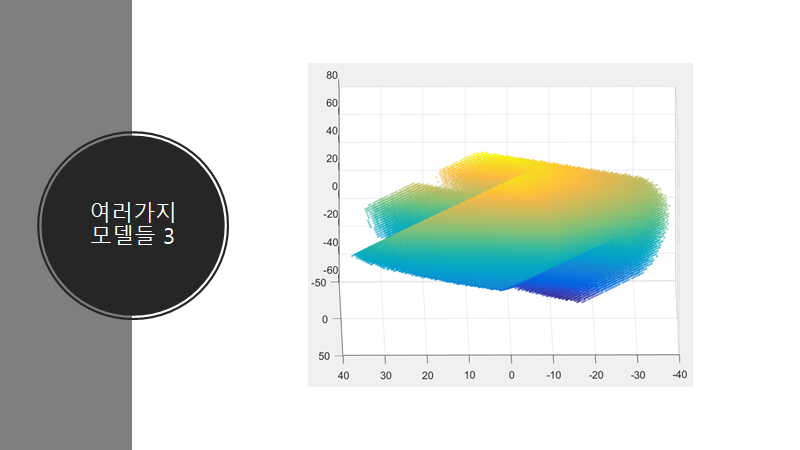

# SpacePiece

space piece presentation.pptx is the presentation file.

Idea

Infer original 3D object via the reversed projection of 2D images
Using Matlab
 

space definition

Making an 3D object with maximum 3 projected images
Each images should be projection of target 3D object in random 3 vectors.

Results

object which has star-shape when viewed from vector [1, 2, 3] and heart shape viewed from vector [-1, 4, 2]

Star viewed from x,y,z axis

Hexagonal star viewed from x,y,z axis

Star viewed from [1, 0, 0] and ring viewed from [1, 1, 1]

Heart viewed from [1, 1, 1], arrow viewed from [-1, 1, 2] and hexagon viewed from [0, 0, 1]

